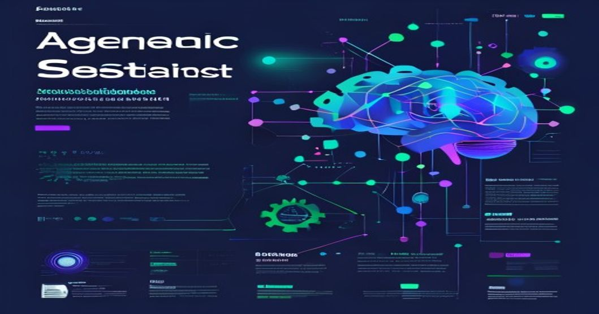

```yaml
tags: [AI, Machine Learning, LLMs, Coding Assistants, Architecture]
```

# How Agentic Coding Assistants Actually Work Under the Hood



---

### TL;DR:
- Agentic coding assistants like GitHub Copilot rely on large language models (LLMs) such as Codex, trained on massive code and natural language datasets.
- Production architectures use client-server designs, combining LLM inference APIs, IDE plugins, and real-time contextual input.
- We’ll dive into the inner workings, share practical implementation tips, and discuss common pitfalls we encountered when deploying one in production.

---

## Introduction

Agentic coding assistants are transforming how developers build software. Tools like GitHub Copilot, Amazon CodeWhisperer, and Tabnine are more than just autocomplete—they generate full code snippets, detect bugs, and even offer human-like explanations for complex code.

This is all possible due to breakthroughs in transformer-based large language models and production-ready NLP pipelines. But while these tools seem magical, their success relies on carefully designed systems, robust AI models, and real-time context-awareness.

In this article, we’ll deep dive into **how these systems actually work** with a focus on architecture, code examples, and lessons learned deploying such systems in production.

---

## Technical Deep Dive

### Core Components of an Agentic Assistant
At their core, agentic coding assistants consist of the following components:

1. **Language Model Backend**:
   - A large language model (e.g., Codex, GPT-4, or even smaller specialized models like CodeT5).
   - Fine-tuned on a combination of public code repositories and natural language data.
   
2. **Contextual Input Handler**:
   - Extracts relevant context from the Integrated Development Environment (IDE), such as:
     - Current file content
     - Surrounding code
     - Developer's cursor position
   
3. **Inference Pipeline**:
   - Converts the IDE context into a prompt suitable for the LLM.
   - Sends the prompt to the backend model for inference.
   
4. **Client-Side Integration**:
   - IDE plugins or extensions (e.g., for VSCode, JetBrains, etc.) that display the model's suggestions and handle real-time user interactions.

Let’s explore these components with some Python-based examples.

---

### Code Example: Prompt Construction from IDE Context

The first step in generating intelligent suggestions is **extracting context from the IDE**. Here's an example of how to transform a file's content and cursor position into a prompt:

```python
def build_prompt(file_content: str, cursor_position: int, max_context_size: int = 512) -> str:
    """
    Builds an LLM prompt by extracting relevant context around the cursor position.
    
    Args:
        file_content (str): The text of the current file.
        cursor_position (int): The position of the cursor in the file.
        max_context_size (int): Maximum size of the context for the prompt.
    
    Returns:
        str: A prompt string for the LLM.
    """
    # Split file content into lines
    lines = file_content.splitlines()

    # Find the current line and surrounding context
    current_line_idx = cursor_position // len(lines[0])
    start_idx = max(0, current_line_idx - max_context_size // 2)
    end_idx = min(len(lines), current_line_idx + max_context_size // 2)

    # Extract relevant lines and construct the prompt
    context_lines = lines[start_idx:end_idx]
    prompt = "\n".join(context_lines)

    return f"### Context ###\n{prompt}\n### Code to complete:"

# Example usage
file_content = """def add(a, b):
    return a + b

print(add(1, """
cursor_position = len(file_content) - 1

prompt = build_prompt(file_content, cursor_position)
print(prompt)
```

This results in a prompt that provides just enough context for the LLM to understand what the user is trying to do.

---

### Backend Model Inference

The next step is sending the prompt to the backend model. In production, this typically involves an API, which could be an OpenAI endpoint or a custom LLM.

**Example Python code for inference:**

```python
import openai

def query_llm(prompt: str, api_key: str, model: str = "code-davinci-002") -> str:
    """
    Queries a language model (e.g., OpenAI Codex) with the given prompt.

    Args:
        prompt (str): The prompt to provide to the LLM.
        api_key (str): API key for authenticating with the LLM service.
        model (str): The model to use for the LLM.

    Returns:
        str: The generated response from the LLM.
    """
    openai.api_key = api_key

    response = openai.Completion.create(
        engine=model,
        prompt=prompt,
        max_tokens=150,
        temperature=0.7,
        stop=["###"]
    )
    return response['choices'][0]['text'].strip()

# Example usage
api_key = "your-api-key"
llm_response = query_llm(prompt, api_key)
print(llm_response)
```

This function sends the constructed prompt to the model and retrieves the completion, which is then displayed in the IDE.

---

### Architecture Diagram (Described)

The architecture of an agentic coding assistant can be visualized as follows:

```
+-----------------+
|     IDE         | <---> [IDE Plugin: Context Extraction, UI]
+-----------------+           |
                              V
   +--------------------+   [Prompt Builder: Formats Data]
   | Client Application | <-------------------+
   +--------------------+                     |
                              +--------------+
                              V
                  +-----------------------+
                  | LLM Inference Server  |
                  | (Codex, CodeT5, etc.) |
                  +-----------------------+
                              |
                              V
                  +-----------------------+
                  |   Language Model API  |
                  +-----------------------+
```

**Explanation**:
1. The **IDE plugin** extracts the user context and provides a UI for interaction.
2. The **Client Application** handles prompt construction and sends requests to the **LLM server**.
3. The LLM server processes the request, leveraging a pre-trained model, and sends back a response.
4. The **IDE plugin** displays the suggestion to the developer.

---

## Production Lessons Learned

From our experience deploying an agentic coding assistant in production at Reallytics.ai, here are some practical lessons:

### 1. **Latency Matters**
Even a few hundred milliseconds of latency can disrupt the developer's flow. To optimize:
- Use **caching** to store frequently used prompts and responses.
- Consider **model distillation** to deploy smaller, faster models for simple tasks.

### 2. **Context Management is Hard**
Providing too much context increases inference time, while too little context makes the suggestions irrelevant. Striking the right balance is key:
- Use a **sliding window strategy** for context extraction.
- Implement **token prioritization**, favoring recent and proximal code.

### 3. **Model Fine-Tuning**
Out-of-the-box LLMs are powerful, but fine-tuning on domain-specific codebases improved accuracy for us by up to 20%.

### 4. **Error Handling is Critical**
LLMs can generate syntactically correct but logically flawed code. To mitigate:
- Implement **fallback mechanisms** (e.g., suggest partial completions instead of full functions).
- Perform **static analysis** on generated code before displaying it in the IDE.

---

## Key Takeaways

- Agentic coding assistants combine **LLMs**, **context extraction**, and **client-server interaction** to deliver intelligent code suggestions.
- Production systems require thoughtful **latency optimizations**, **context management**, and **robust error handling**.
- With fine-tuning and careful engineering, these systems can significantly boost developer productivity.

---

## Further Reading

1. [OpenAI Codex Documentation](https://platform.openai.com/docs/models/codex)
2. [GitHub Copilot Technical Preview](https://github.com/features/copilot)
3. [CodeBERT: A Pre-trained Model for Programming Languages](https://arxiv.org/abs/2002.08155)

_By Reallytics AI_