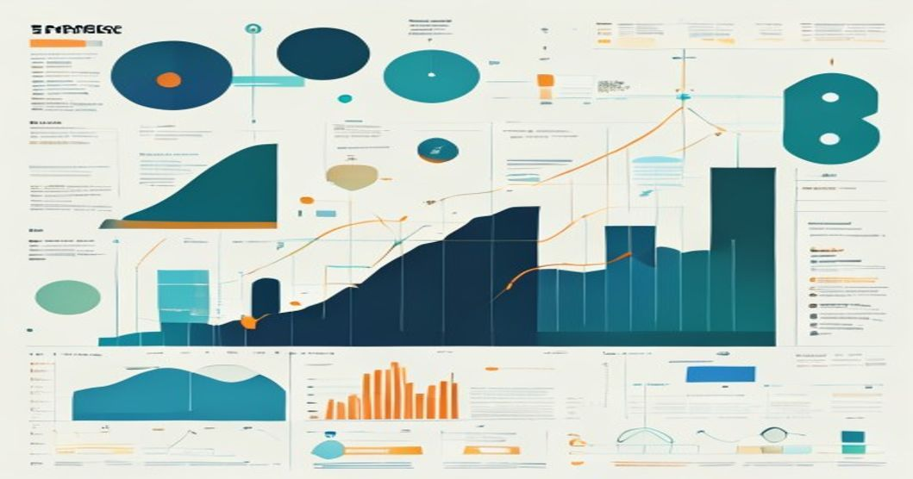

```yaml
tags: [Explainable AI, Time Series Forecasting, SHAP, Energy Demand Prediction]
```

# Uncovering the Black Box: Using SHAP Values to Explain Time Series Forecasts in Energy Demand Prediction



---

### TL;DR:
- SHAP values provide actionable insights into the "why" behind time series forecasts, particularly useful in critical domains like energy demand prediction.
- Combining SHAP with advanced forecasting models like LSTM or Prophet helps utilities understand the impact of features like temperature or historical demand on predictions.
- In production, integrating SHAP into a model deployment pipeline requires efficient data handling and compute resources to ensure real-time explainability.

---

## Introduction: Why Explainable AI Matters in Time Series Forecasting

Time series forecasting plays a pivotal role in energy demand prediction by helping utilities and grid operators balance energy supply with demand fluctuations. However, one of the biggest challenges with modern machine learning models—especially deep learning approaches like LSTMs—is their inherent "black box" nature. While these models achieve high predictive accuracy, understanding the driving factors behind their predictions is often opaque.

Explainable AI (XAI) frameworks, such as SHAP (SHapley Additive exPlanations), have emerged as powerful tools to bridge this gap. SHAP values highlight how each feature contributes to a model’s output, offering key insights into the "why" behind predictions. For energy demand forecasting, this could mean understanding how temperature, humidity, or past demand patterns influence the predicted energy requirements.

This article dives into leveraging SHAP for explainable time series forecasting, with a focus on energy demand prediction. It will cover production-grade implementations, practical challenges, and lessons learned from deploying SHAP-enhanced models.

---

## Technical Deep Dive: Using SHAP to Explain Energy Demand Predictions

### Feature Importance via SHAP in Time Series Models

SHAP is grounded in Shapley values from cooperative game theory, where each feature is treated as a "player" contributing to the "game" of predicting the outcome. Here's a step-by-step breakdown:

1. **Dataset**: Energy demand forecasting typically uses data like:
   - Historical energy consumption (time series data).
   - Weather features such as temperature, humidity, wind speed.
   - Calendar features like day of the week, holidays.
   
2. **Model**: We'll use an LSTM model for sequential data forecasting. LSTMs are ideal for modeling temporal dependencies, but their predictions are often hard to interpret.

3. **SHAP Integration**: Using SHAP’s Python library, we can compute feature attributions for a specific forecast.

### Code Example: Training and Explaining an LSTM Model

Here’s a simplified example of using SHAP to explain predictions from an LSTM model for energy demand forecasting.

#### Step 1: Load and preprocess the dataset
```python
import pandas as pd
import numpy as np
from sklearn.preprocessing import MinMaxScaler
from tensorflow.keras.models import Sequential
from tensorflow.keras.layers import LSTM, Dense

# Load energy demand data
df = pd.read_csv('energy_demand.csv')

# Select relevant features
features = ['temperature', 'humidity', 'historical_demand']
target = 'energy_demand'

# Normalize features
scaler = MinMaxScaler()
df[features] = scaler.fit_transform(df[features])

# Prepare training data
def create_sequences(data, sequence_length=24):
    sequences = []
    labels = []
    for i in range(sequence_length, len(data)):
        sequences.append(data[i-sequence_length:i])
        labels.append(data[i])
    return np.array(sequences), np.array(labels)

X, y = create_sequences(df[features].values, sequence_length=24)
```

#### Step 2: Train an LSTM model
```python
# Define LSTM model
model = Sequential([
    LSTM(50, activation='relu', input_shape=(X.shape[1], X.shape[2])),
    Dense(1)
])
model.compile(optimizer='adam', loss='mse')

# Train the model
model.fit(X, y, epochs=10, batch_size=32)
```

#### Step 3: Explain predictions using SHAP
```python
import shap

# Initialize SHAP explainer
explainer = shap.KernelExplainer(model.predict, X[:100])

# Explain a specific prediction
shap_values = explainer.shap_values(X[0:1])

# Visualize SHAP values
shap.summary_plot(shap_values, features, feature_names=features)
```

In the `shap.summary_plot`, you'll see a breakdown of how features such as temperature, humidity, and historical demand contributed to the model's forecast.

---

## Production Architecture: Integrating SHAP for Real-Time Explainability

In a production environment, the architecture for deploying explainable AI models for energy demand forecasting typically includes:

1. **Data Ingestion**:
   - Collect data from sensors, weather APIs, and historical databases.
   - Example: AWS IoT Core for real-time sensor data, OpenWeather API for weather features.

2. **Data Preprocessing**:
   - Apply normalization, sequence generation, and impute missing values.
   - Use pipelines in tools like Apache Airflow or AWS Glue.

3. **Model Training**:
   - Train an LSTM model using TensorFlow or PyTorch.
   - Incorporate hyperparameter tuning via frameworks such as Optuna or SageMaker Hyperparameter Optimization.

4. **Model Serving**:
   - Deploy the trained model using TensorFlow Serving or SageMaker endpoints.
   - Ensure low latency to handle real-time energy forecasting.

5. **Explainability Module**:
   - Use SHAP to generate explanations in real time.
   - Deploy SHAP computations as part of the API response, or precompute SHAP values for common scenarios to reduce latency.

### ASCII Architecture Diagram
```plaintext
                            ┌────────────────────────┐
                            │   Data Ingestion       │
                            │   (IoT Sensors, APIs)  │
                            └─────────┬──────────────┘
                                      │
                            ┌─────────▼──────────────┐
                            │   Data Preprocessing   │
                            │   (Airflow, Glue)      │
                            └─────────┬──────────────┘
                                      │
                            ┌─────────▼──────────────┐
                            │   Model Training       │
                            │   (LSTM, Optuna)       │
                            └─────────┬──────────────┘
                                      │
                            ┌─────────▼──────────────┐
                            │   Model Serving        │
                            │   (SageMaker, TF)      │
                            └─────────┬──────────────┘
                                      │
                            ┌─────────▼──────────────┐
                            │   Explainability       │
                            │   (SHAP Integration)   │
                            └────────────────────────┘
```

---

## Production Lessons Learned

From experience deploying explainable AI systems for energy demand forecasting, here are some practical insights:

1. **SHAP Computation Overhead**: SHAP calculations, particularly KernelExplainer, can be computationally expensive for large datasets. Precompute SHAP values for common scenarios to reduce latency.
   
2. **Model Drift**: Over time, feature importance may change as energy demand patterns evolve. Regularly retrain models and validate SHAP explanations to ensure they remain relevant.

3. **Scalability**: For real-time forecasting, ensure your infrastructure can scale. Kubernetes can be used to auto-scale SHAP computation pods alongside model-serving containers.

4. **Feature Engineering**: Invest time in identifying key features like temperature and historical demand. Poor feature selection can result in misleading SHAP explanations.

---

## Key Takeaways

- **SHAP bridges the gap between accuracy and interpretability**, making complex time series forecasting models more trustworthy.
- Integrating SHAP into production pipelines requires careful attention to compute resources and latency constraints.
- Continuous monitoring of model performance and feature importance is crucial for maintaining reliable explanations.

---

## Further Reading

- [SHAP Documentation](https://shap.readthedocs.io/)
- [Time Series Forecasting with TensorFlow](https://www.tensorflow.org/tutorials/structured_data/time_series)
- [Amazon SageMaker Developer Guide](https://docs.aws.amazon.com/sagemaker/latest/dg/whatis.html)
- [Lundberg & Lee (2017): SHAP paper](https://arxiv.org/abs/1705.07874)

---

*By Reallytics AI*